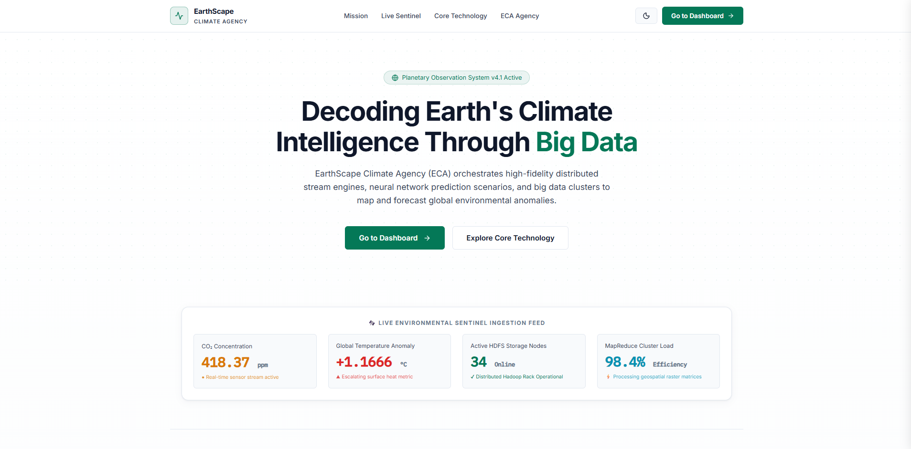
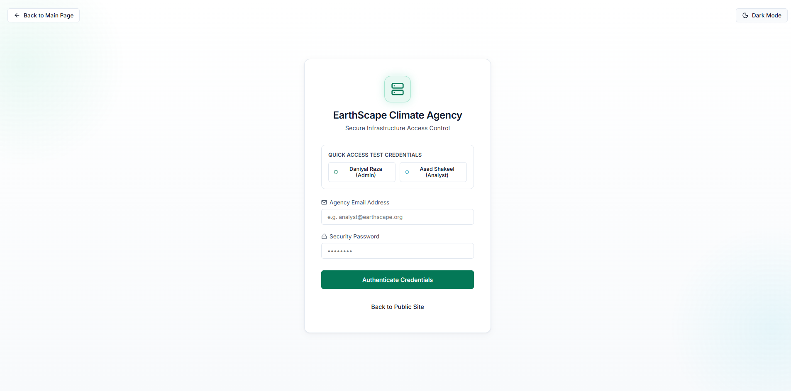
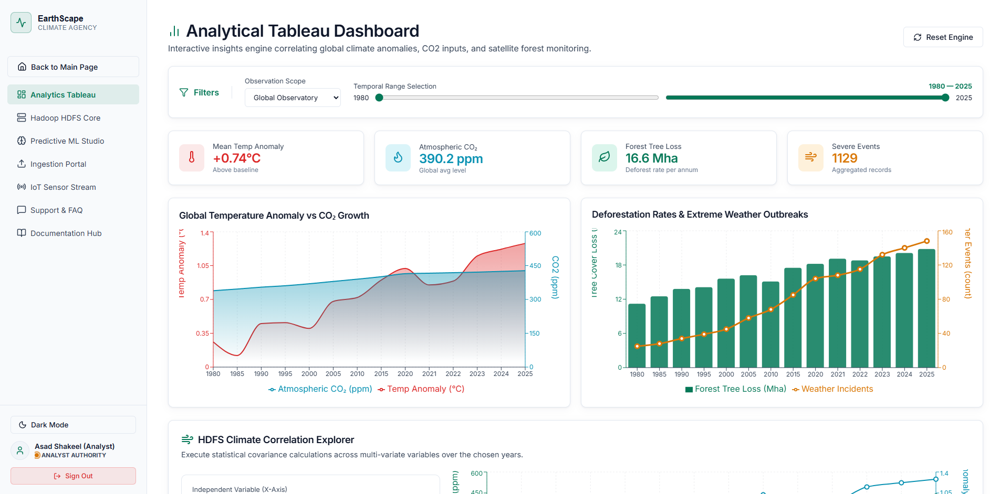
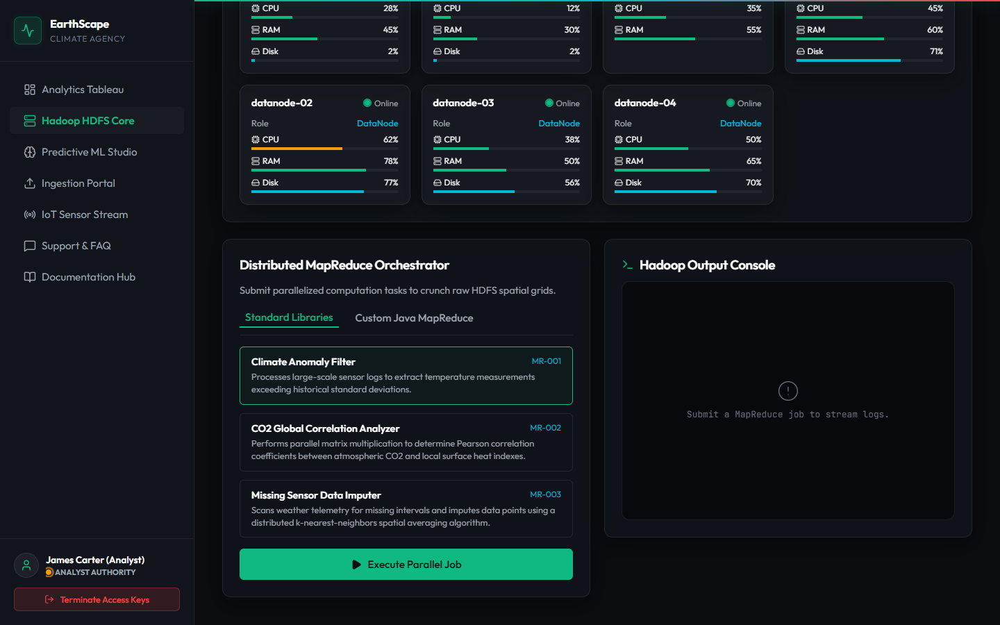
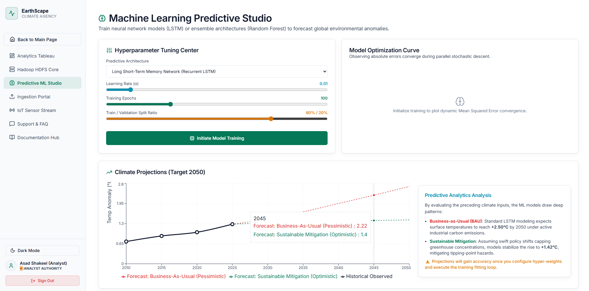
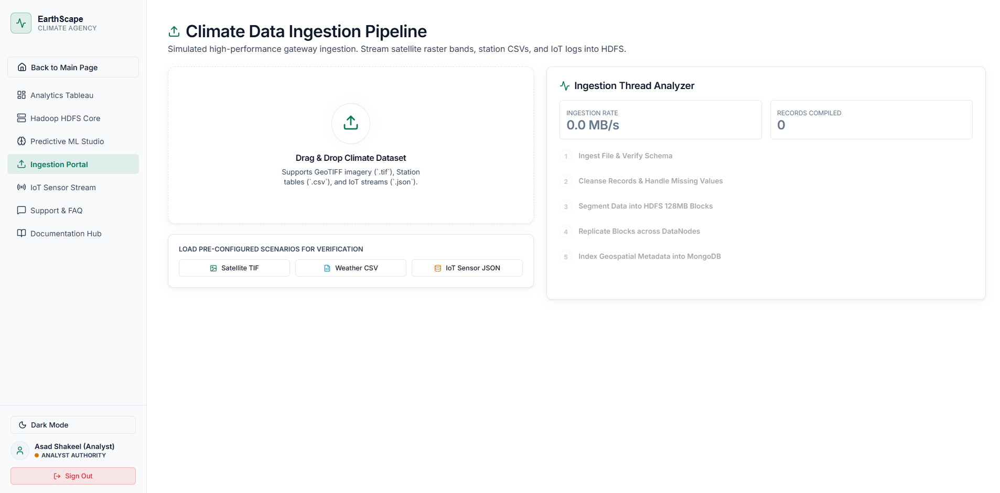
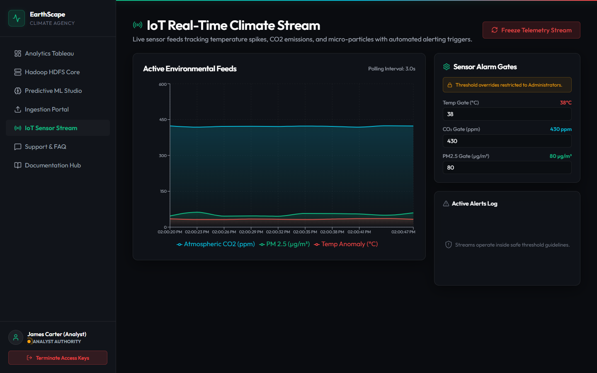
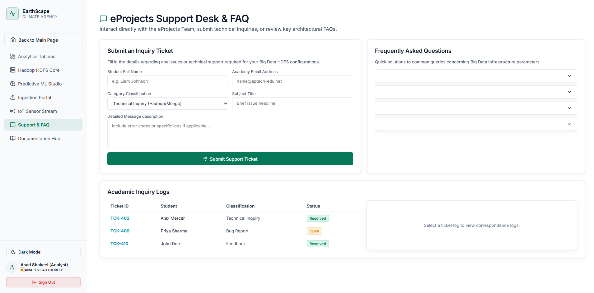
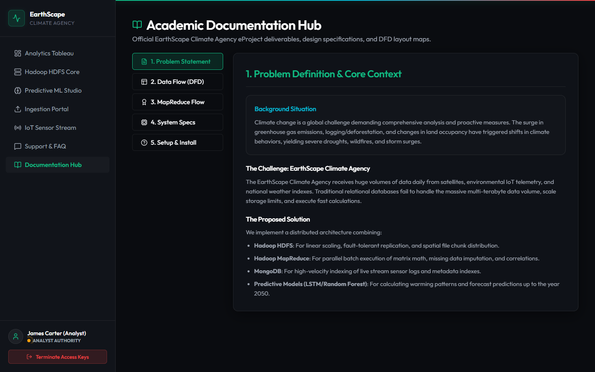

# 🌍 EarthScape Climate Agency


**Semester End eProject (Sem-6)**
**Aptech Computer Education**

---

# 📌 Project Information

**Project Title:** EarthScape Climate Agency

**Project Type:** Big Data Analytics Dashboard (Hadoop & Climate Intelligence Simulator)

### 📅 Project Duration

* **Start Date:** 05-Jun-2026
* **End Date:** 05-Jul-2026

### 🚀 Live Demo

🔗 https://earthscape-climate-agency.vercel.app/

---

# 👨‍💻 Project Team

| Student ID     | Student Name              |
| -------------- | ------------------------- |
| Student1495874 | SHAIKH DANIYAL RAZA       |
| Student1497264 | SYED HASHIR HUSSAIN NAQVI |
| Student1495906 | ALI HAMZA                 |
| Student1497583 | MUHAMMAD ASJAD ALI        |
| Student1497266 | ASAD SHAKIL               |
| Student1489540 | AMMAD AHMED ZUBERI        |
| Student1496426 | HASSAN BIN SHAMS          |

---

# 🏫 Institution

**Aptech Computer Education Pakistan**
**Semester 6 eProject Submission**
**2026**

---

# 📖 Project Overview

EarthScape Climate Agency is a modern climate intelligence platform developed to demonstrate the practical implementation of Big Data Analytics, Distributed Computing, Machine Learning Forecasting, and Environmental Monitoring Systems.

The platform simulates a real-world Hadoop ecosystem capable of processing large-scale climate datasets collected from satellites, weather stations, and IoT sensors. Through an interactive dashboard, users can explore HDFS architecture, monitor distributed nodes, execute MapReduce jobs, analyze climate trends, and forecast future environmental conditions.

This project was developed as part of the Aptech Semester-6 eProject to provide hands-on experience with modern data processing concepts and enterprise dashboard design.

---

# 🎯 Project Objectives

The primary objectives of this project are:

* Simulate Hadoop Distributed File System (HDFS)
* Demonstrate MapReduce Processing Workflows
* Visualize Climate Data Analytics
* Forecast Future Climate Trends using Machine Learning
* Monitor Real-Time IoT Environmental Data
* Provide Secure Authentication and Authorization
* Deliver an Enterprise-Level Dashboard Experience

---

# ✨ Features

## 🔐 Authentication & Authorization

* Secure Login System
* Role-Based Access Control
* Admin Dashboard
* Analyst Dashboard
* Protected Routes

## 📥 Data Ingestion Portal

* CSV Upload Support
* JSON Upload Support
* GeoTIFF Simulation
* HDFS Block Mapping Visualization
* Data Validation System

## 🗄️ HDFS Cluster Simulator

* NameNode Visualization
* DataNode Monitoring
* ResourceManager Simulation
* Rack Awareness Simulation
* Replication Factor Mapping
* CPU Usage Monitoring
* RAM Usage Monitoring

## ⚡ MapReduce Engine

* Split Phase Visualization
* Mapping Stage Simulation
* Shuffle & Sort Stage
* Reduce Stage Processing
* Live Processing Logs
* Job Execution Tracking

## 🤖 Predictive ML Studio

* Climate Forecast Dashboard
* LSTM Prediction Simulation
* Hyperparameter Tuning Interface
* Temperature Forecasting Until 2050
* Convergence Curve Analysis
* Model Performance Graphs

## 📡 IoT Telemetry Stream

* Real-Time Sensor Data Feed
* Alert Threshold Controls
* Automated Warning Notifications
* Environmental Monitoring Dashboard
* Sensor Health Tracking

## 🎫 Support & Feedback Desk

* Ticket Submission System
* Feedback Management
* Query Logging
* Support Response Simulation

---

# 🏗️ System Architecture

```text
React-Vite Client Portal
│
├── Authentication Module
│
├── Hadoop HDFS Simulator
│   ├── NameNode Manager
│   ├── DataNode Cluster
│   └── Replication Engine
│
├── MapReduce Processing Engine
│   ├── Split Phase
│   ├── Map Phase
│   ├── Shuffle & Sort
│   └── Reduce Phase
│
├── Machine Learning Studio
│   ├── Forecast Engine
│   ├── LSTM Simulator
│   └── Analytics Dashboard
│
├── IoT Monitoring Module
│
└── Support & Feedback System
```

---

# 📊 Core Modules

### 1. Authentication Module

Handles user login, role management, and secure access control.

### 2. Data Ingestion Portal

Accepts climate datasets and prepares them for HDFS storage simulation.

### 3. HDFS Simulator

Represents Hadoop's distributed storage architecture with replication and node monitoring.

### 4. MapReduce Engine

Simulates distributed data processing through Split, Map, Shuffle, Sort, and Reduce stages.

### 5. Machine Learning Studio

Provides climate forecasting visualizations and predictive analysis.

### 6. IoT Monitoring System

Displays real-time environmental sensor streams and automated alert systems.

### 7. Support Desk

Allows users to submit support requests and feedback tickets.

---

# 🛠️ Technology Stack

## Frontend

* React.js
* Vite
* JavaScript (ES6+)
* Tailwind CSS
* Framer Motion
* React Router DOM

## Big Data Concepts

* Apache Hadoop (Simulation)
* HDFS Architecture
* MapReduce Workflow
* Distributed Computing Concepts
* Data Replication Concepts

## Database

* MongoDB

## Machine Learning Concepts

* LSTM Forecasting
* Predictive Analytics
* Climate Trend Analysis

## Development Tools

* Visual Studio Code
* Git
* GitHub

## Deployment

* Vercel

---

# 💻 Hardware Requirements

* Intel Core i5 Processor or Higher
* Minimum 8 GB RAM
* Recommended 16 GB RAM
* 500 GB SSD Storage
* Integrated or Dedicated Graphics
* Internet Connection

---

# ⚙️ Software Requirements

* Windows 10 / Windows 11 / Linux
* Node.js v18+
* npm
* Visual Studio Code
* Git
* MongoDB (Optional)
* Modern Web Browser

---


And update the Installation Guide to:

````md
# 🚀 Installation Guide

### Clone Repository

```bash
git clone https://github.com/daniyal0815/earthscape-climate-agency.git
```

### Navigate to Project Directory

```bash
cd earthscape-climate-agency
```

### Install Dependencies

```bash
npm install --legacy-peer-deps
```

### Start Development Server

```bash
npm run dev
```

### Build Production Version

```bash
npm run build
```

### Preview Production Build

```bash
npm run preview
```

### Open Application

```text
http://localhost:5173
```

---

# 📂 Project Structure

```text
earthscape-climate-agency/
│
├── public/
│
├── src/
│   ├── assets/
│   ├── components/
│   ├── pages/
│   ├── layouts/
│   ├── hooks/
│   ├── services/
│   ├── utils/
│   ├── App.jsx
│   └── main.jsx
│
├── package.json
├── vite.config.js
└── README.md
```

---

# 📚 Educational Concepts Demonstrated

* Hadoop Distributed File System (HDFS)
* Distributed Storage Systems
* Data Replication Techniques
* MapReduce Processing
* Big Data Analytics
* Climate Intelligence Systems
* Environmental Monitoring
* IoT Data Streaming
* Machine Learning Forecasting
* Dashboard Visualization
* Authentication & Authorization
* Enterprise UI/UX Design

---

# 📸 Screenshots

### Landing Page


### Login Page


### Dashboard Overview


### HDFS Cluster View


### Predictive ML Studio


### Ingestion Portal


### IoT Sensor Stream


### Support & FAQ


### Documentation Hub

---

#  Academic Submission Deliverables

* Working Application
* Source Code
* Compiled Build
* eProject Report
* DFD Diagrams
* Flowcharts
* Process Diagrams
* Database Design
* User Guide
* Developer Guide
* Project Demonstration Video

---

#  Contributors

* Shaikh Daniyal Raza
* Syed Hashir Hussain Naqvi
* Ali Hamza
* Muhammad Asjad Ali
* Asad Shakil
* Ammad Ahmed Zuberi
* Hassan Bin Shams

---

#  Acknowledgement

We would like to express our sincere gratitude to Aptech Computer Education, our instructors, mentors, and fellow team members for their valuable guidance and support throughout the development of this project.

This eProject provided practical exposure to Big Data concepts, distributed computing architectures, machine learning forecasting techniques, and modern web application development. The experience gained through this project has significantly enhanced our technical knowledge, teamwork, and problem-solving skills.

---

# 📜 License

This project was developed by the EarthScape Climate Agency Team for academic purposes as part of the Aptech Computer Education Semester-6 eProject.

© 2026 EarthScape Climate Agency Team. All Rights Reserved.
